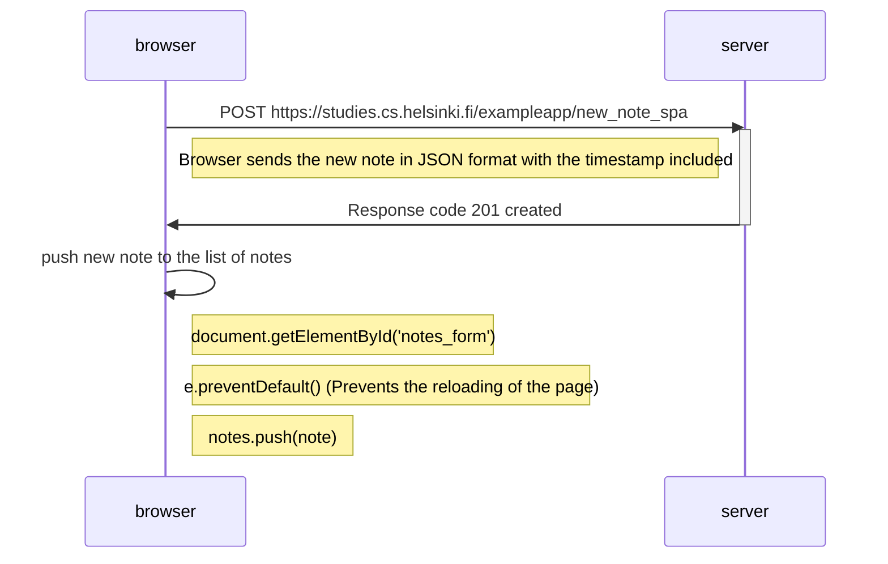

```mermaid
sequenceDiagram
    participant browser
    participant server

    browser->>server: POST https://studies.cs.helsinki.fi/exampleapp/new_note_spa
    activate server
    Note right of browser: Browser sends the new note in JSON format with the timestamp included
    server->>browser: Response code 201 created
    deactivate server

    browser->>browser: push new note to the list of notes
    Note right of browser: document.getElementById('notes_form')
    Note right of browser: e.preventDefault() (Prevents the reloading of the page)
    Note right of browser: notes.push(note)
```
